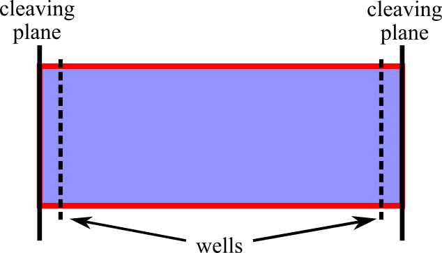
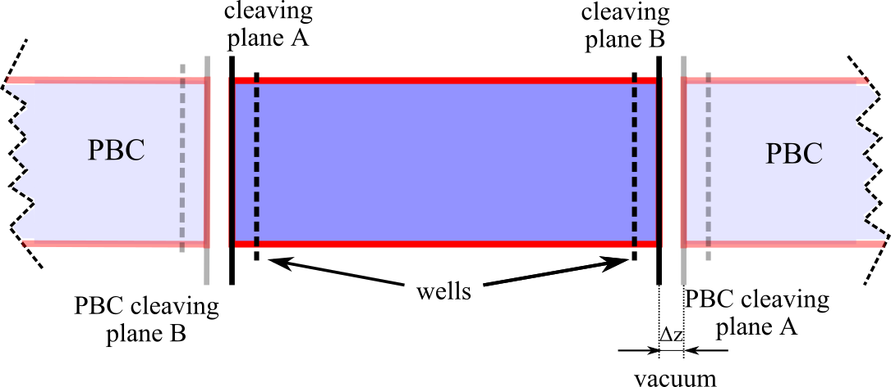
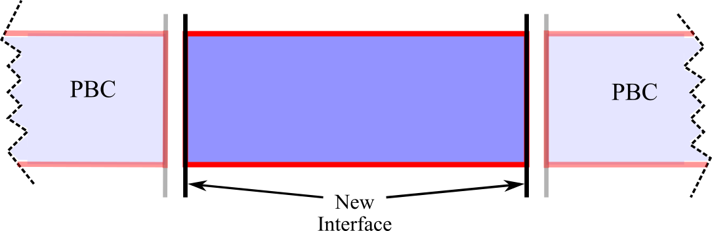

# Examples

In this section `/` is the package's root folder.

## Solid-Vacuum interface of a Lennard-Jones crystal with wells

In this example we will set up the cleaving calculation for the calculation of the SFE of a Lennard-Jones crystal in contact with vacuum.

The input files for the whole calculations are already given in the directory `/examples/lj_SV` but in this tutorial we will go through the writing of such files from scratch. Note that whole example requires roughly one hour of computation time on 16 cores to generate a sensible output. However, you can run shorter simulations to acquaintance yourself with the code. To do this, change the input file variables `eqnts` and `nts` (equilibration and production number of time steps) to smaller values.

First of all, create a new folder and step in it.

### Step 1 

1. Create a `step1` folder and enter it. Create the `out/`, `data/`, `restart/`, and `dump/` subfolders. Note that you can safely comment out the `dump` and `restart` lines of the input, since dump and restart files are not needed for the cleaving computation. In this case you don't need to create the `restart/` and `dump/` folders.

2. Prepare the LAMMPS input file. Here we use `/examples/lj_S/bulk.in` file as a starting point. Copy it to the current folder, delete all the lines after the `f3` fix and change the temperature to 0.1 `variable Tsyst equal 0.1`.

3. Prepare the starting configuration. Here we copy the `/examples/lj_systems/fcc111-T01.lmp` data file to the current folder. The file contains the starting configuration, a Lennard-Jones fcc crystal oriented along the direction (111) at the (reduced) temperature of 0.1. Edit the `bulk.in` input file so that the correct data file is read (*i.e.* change the `read_data fcc111-T1.lmp` line to `read_data fcc111-T01.lmp`).

4. Prepare a wells file. Here we will use the `/examples/lj_systems/fcc111-T01-wells.lmp` file, which should be copied to the current folder. The exact format of this file is given in the description of the appropriate fix.

5. Prepare a file containing the variation of the strength of the wells. This file contains a sequence of increasing consecutive numbers in the interval $[0,1]$ (extremes included). Here is a (truncated) example:

```
0.0
0.001
0.002
0.05
0.1
...
0.998
0.999
1.0
```

Note:

* The file must start at 0 and end at 1. 
* There is no internal control in the code that checks that the boundaries are correct
   
Here we will be using the `/examples/lj_SV/step1/lambda_wells.dat` file, so make sure to copy it to the current folder.



6. The wells in the system are introduced using the new fix `wellPforce`:

```
fix f2 all wellPforce ${dw} ${rw} ${expp} ${lambda} file fcc111-T01-wells.lmp 
```

where the explanation of the different parameters is given in the description of the fix. In the wells version of the cleaving model, the wells are introduced by switching the parameter lambda from 0 (no interactions between atoms and wells) and 1 (full interactions between atoms and wells). LAMMPS allows the creation of an input file which can perform several runs in a row by changing the parameter between the different runs. The relevant code that should be added to `bulk.in` is

```
variable Nevery  equal 100
variable Nrepeat equal 5
variable Nfreq   equal 500

variable lam file lambda_wells.dat
variable i     equal 1
variable dw    equal 6.0
variable a0    equal exp(1/3*ln(4/1.05604))
variable rw    equal sqrt(2)*${a0}/4.0*1.2
variable expp  equal 3.0

label here
variable    lambda equal ${lam}

fix f2 all wellPforce ${dw} ${rw} ${expp} ${lambda} file fcc111-T01-wells.lmp 

print       "Well depth ${lambda}"
run ${eqnts}

fix  f5 all ave/time ${Nevery} ${Nrepeat} ${Nfreq} c_thermo_temp c_thermo_pe f_f2 v_lambda file  out/ave.F.${i}.out

run ${nts}

unfix f5
unfix f2 

write_data data/Fstep1.${i}.data nocoeff
variable    ii equal ${i}+1
variable    i  equal ${ii}
next lam
jump SELF here
```

To keep the main directory clean from all the output files generated during the run, we print those files in the `out` and `data` folders.

We refer to the [LAMMPS documentation](https://docs.lammps.org/jump.html) for the use of the `jump` command to create a loop. Each iteration of the loop produces the following files:

* `Fstep1.${i}.data`: data file containing the last configuration of the i-th iteration
* `ave.F.${i}.out`: File which contains a summary of the properties of the system, including the work (`f_f2`)

7. Launch the simulation.

### Step 2

This step for this particular system (a crystal in coexistence with vacuum) is empty, so we can directly go to [Step 3](#step-3).

### Step 3



In the third step we switch off the interactions between the two sides of the cleaving wall. 

1. Create the `step3` folder and enter it. Create the `out/`, `data/`, `dat/`, `restart/`, and `dump/` subfolders (where the latter two can be omitted if the related commands in the LAMMPS script file are commented). The `dat/` folder will contain the output of this step.

2. Copy `fcc111-T01-wells.lmp` and the last `data/Fstep1.*.data` file from the [Step 1](#step-1) folder.

3. Prepare a new LAMMPS input file. We again use the `/examples/lj_S/bulk.in` file as a starting point. Copy it to the current folder, delete all the lines after the `f3` fix and change the temperature to 0.1 `variable Tsyst equal 0.1` and change the name of the data file to match the file copied in sub-step 2.

4. The switching off is implemented directly in the definition of the pair interactions. We therefore need to change the pair interaction in the LAMMPS script file (section *Interactions*) to the new defined type

```
pair_style lj/BGcleavpbc ${cutoff1} ${cutoff2} z
```

All the parameters (`cutoff1`, `cutoff2`, `epsilon`, `sigma`) are identical to those used in [Step 1](#step-1). Note that there is a third parameter in this `pair_style`, the direction normal to the cleaving plane, which is `z` in this case. 

5. Add the command for the wells at the of the LAMMPS script file, together with the definition of the variables that sets the cleaving parameters:

```
variable dw    equal 6.0
variable a0    equal exp(1/3*ln(4/1.05604))
variable rw    equal sqrt(2)*${a0}/4.0*1.2
variable expp  equal 3.0

fix f2 all wellPforce ${dw} ${rw} ${expp} 1.0 file fcc111-T01-wells.lmp
```

In this step the strenght of the wells remains constant, therefore we replace `${lambda}` with 1.

6. Create a file (called `zdir.dat`) for the switching off of the interactions across the cleaving plane (or copy `/examples/LJ_SV/step3/zdir.dat`). The file should contain a list of values that specify how much the box will be moved away from its periodic images along the normal to the cleaving plane (`z` in our case). The file must start with zero, which is the first point of the switching. Here is an example:

```
0.0
0.001
0.002
0.05
0.1
...
2.0
2.2
2.4
2.8
3.2
...
```

Note: the upper boundary should be large enough so that, when the box has moved this much, there are no more interactions between the box and its periodic images. A value of 2.6 is usually enough.

7. The work needed to switch off the interactions (described in the next point) is calculated by adding the line `compute 1 all cleavpairs lj/BGcleavpbc norm 2 z` to end of the LAMMPS script file. The meaning of the parameters is reported in the description of this compute style.

8. The actual switching off is obtained through another loop which increases the size of the box. Since the atoms are kept in place by the cleaving potential, increasing the size of the box creates a vacuum space. When the vacuum space is larger than `cutoff2` than the box and its image across the cleaving wall do not interact anymore. Add the following loop to the end of the LAMMPS script file:

```
variable Nevery  equal 100
variable Nrepeat equal 5
variable Nfreq   equal 500

variable initzhi equal $(zhi)
variable initzlo equal $(zlo)
variable zc file zdir.dat
variable i equal 1

label here
variable dhi equal ${zc}
variable newzhi equal ${dhi}+${initzhi}
variable newzlo equal ${initzlo}

print       "Forward Interaction ${i}: ${zc} "
print       " ${initzhi} ${dhi} zhi "

change_box all z final ${newzlo}  ${newzhi}

print       "B ${initzhi} ${dhi} zhi "

run   ${eqnts}

fix   f6 all ave/time ${Nevery} ${Nrepeat} ${Nfreq}  c_1[*] file dat/inters3.${i}.dat mode vector
fix   f7 all ave/time ${Nevery} ${Nrepeat} ${Nfreq} c_thermo_temp c_thermo_pe f_f2 v_dhi file  out/ave.F.${i}.out

run   ${nts}

unfix f6
unfix f7

write_data  data/Fstep3.${i}.data  nocoeff
variable    ii equal ${i}+1
variable    i  equal ${ii}
next zc
jump SELF here
```

We refer to the [LAMMPS documentation](https://docs.lammps.org/change_box.html) for the exact explanation of the `change_box` command.

9. Launch the simulation.


### Step 4



In the last step we remove the wells leaving free the newly created interfaces. 

1. Create the `step4` folder and enter it. Create the `out/`, `data/`, `restart/`, and `dump/` subfolders (where the latter two can be omitted if the related commands in the LAMMPS script file are commented). The `out/` folder will contain the output of this step.

2. Copy `fcc111-T01-wells.lmp` and the last `data/Fstep3.*.data` file from the [Step 3](#step-3) folder.

3. Prepare a new LAMMPS input file. We again use the `/examples/lj_S/bulk.in` file as a starting point. Copy it to the current folder, delete all the lines after the `f3` fix and change the temperature to 0.1 `variable Tsyst equal 0.1` and change the name of the data file to match the file copied in sub-step 2.

4. Prepare a file containing the variation of the strength of the wells. This file contains a sequence of increasing consecutive numbers in the interval $[0,1]$ (extremes included). Here is a (truncated) example:

```
1.0
0.99
0.98
...
0.02
0.01
0.0
```

Note:

* The file must start at 1 and end at 0. 
* There is no internal control in the code that checks that the boundaries are correct.
* The values does not need to be the same (in reverse order) of those used in [Step 1](#step-1).

Here we will be using the `/examples/lj_SV/step4/rev_lambda_wells.dat` file, so make sure to copy it to the current folder.

5. The loop in [Step 4](#step-4) in analogous to the loop in [Step 1](#step-1) run backwards

```
variable Nevery  equal 100
variable Nrepeat equal 5
variable Nfreq   equal 500

variable lam   file rev_lambda_wells.dat
variable dw    equal 6.0
variable a0    equal exp(1/3*ln(4/1.05604))
variable rw    equal sqrt(2)*${a0}/4.0*1.2
variable expp  equal 3.0
variable i     equal 1

label here
variable    lambda equal ${lam}

fix f2 all wellPforce ${dw} ${rw} ${expp} ${lambda} file fcc111-T01-wells.lmp
variable totW   equal "f_f2"

print       "Well depth ${lambda}"

run   ${eqnts}

fix  f6 all ave/time  ${Nevery} ${Nrepeat} ${Nfreq}  c_thermo_temp c_thermo_pe v_totW v_lambda f_f2   file out/ave.F.$i.out

run  ${nts}

unfix f2
unfix f6
write_data data/Fstep4.$i.data nocoeff
variable    ii equal $i+1
variable    i  equal ${ii}
next lam
jump SELF here
```

6. Launch the simulation.

### Calculation of the SFE 

The SFE is obtained by summing the work performed in the [Step 1](#step-1), [Step 3](#step-3), [Step 4](#step-4)

1. The files `.out` generated in [Step 1](#step-1) contains the quantity `f_f2`, which is the work performed. An average of that quantity for each lambda gives the variation of the energy in Step1. The integration of the results quantity over lambda gives the total work in [Step 1](#step-1).

2. The files `.dat` generated in [Step 3](#step-3) contains the interactions _switched-off_ during the [Step 3](#step-3). By averaging these values for each value of zw we obtain the variation of the energy, and the integration of the results over zw gives the total work done in [Step 3](#step-3).

3. [Step 4](#step-4) is analogous to [Step 1](#step-1).
