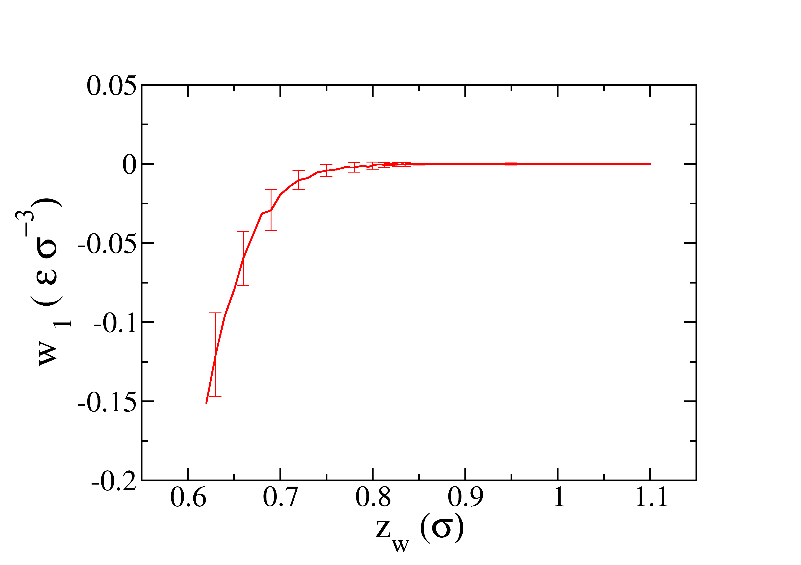
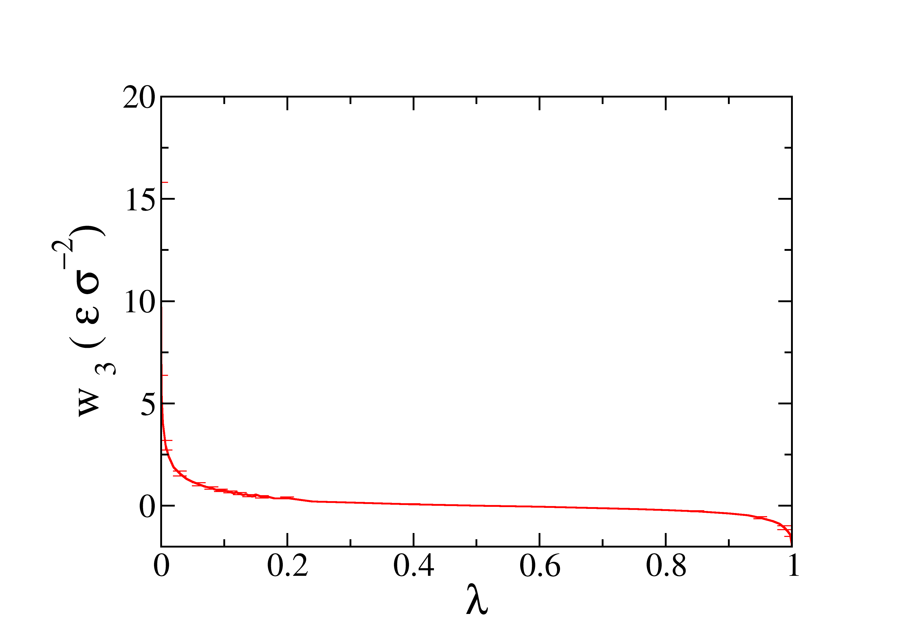
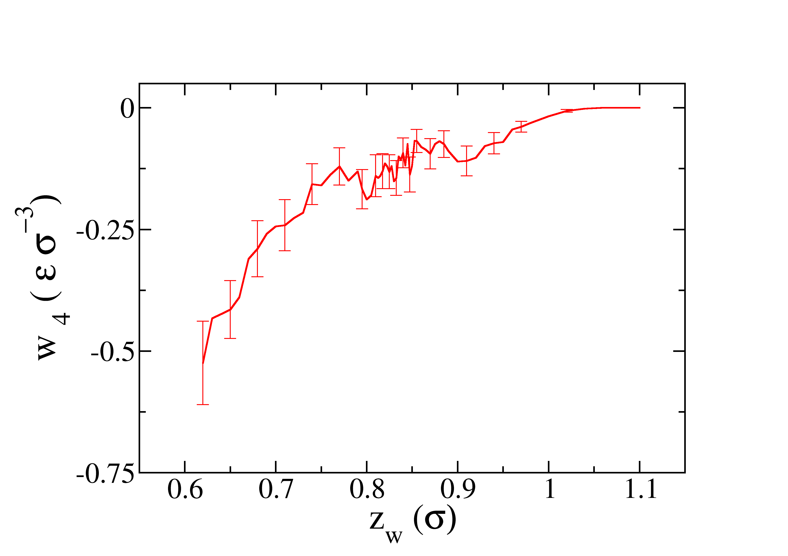

# Solid-Liquid interface of a Lennard-Jones crystal in contact with a Lennard-Jones liquid with walls

````{note}
This example requires few hours of computation time on 16 cores to generate a sensible output. However, you can run shorter simulations to acquaintance yourself with the code. To do this, change the input file variables `eqnts` and `nts` (equilibration and production number of time steps) to smaller values and/or reduce the number of points to move the walls ([Step 1](#step-1), [Step 2](#step-2) or [Step 4](#step-4)) or switch off the interactions ([Step 3](#step-3)).
````

````{note}
In this section `/` is the package's root folder.
````

In this example we will set up the cleaving calculation for the calculation of the SFE of a Lennard-Jones crystal in contact with its liquid at a temperature $T = 0.617$.

The input files for the whole calculations can be found in the directory `/examples/lj_SL` but in this tutorial we will go through the writing of such files from scratch.

First of all, create a new folder `lj_SL` and step in it. Copy the folder `/example/lj_SL/utils/` in the folder `lj_SL` just created. The folder `/utils/` contains some simple programs and script that will be needed to run the cleaving method and analyze the results.

## Step 1 

1. Create a `step1` folder and enter it. Create the `out/`, `data/`, `restart/`, and `dump/` subfolders. Note that you can safely comment out the `dump` and `restart` lines of the input, since dump and restart files are not needed for the cleaving computation. In this case you don't need to create the `restart/` and `dump/` folders.

2. Prepare the LAMMPS input file. Here we use `/examples/lj_S/bulk.in` file as a starting point. Copy it to the current folder, delete all the lines after the `f3` fix and change the temperature to 0.617 `variable Tsyst equal 0.617`.

3. Prepare the starting configuration. Here we copy the `/examples/lj_systems/fcc111-T1.lmp` data file to the current folder. The file contains the starting configuration: a Lennard-Jones fcc crystal oriented along the direction (111) at the (reduced) temperature of 0.617. 

4. Prepare a walls file. Here we will use the `/examples/lj_systems/fcc111-T1-walls.lmp` file, which should be copied to the current folder. The exact format of this file is given in the description of the appropriate fix.

5. Prepare a file containing the variation of the strength of the walls. The varying quantity in this case is the position of the walls with respect to the cleaving plane, $z_w$. The starting position of the walls is denoted as $z_{w,i}$, whereas the final position will be denoted as $z_{w,f}$. This file contains a sequence of decreasing consecutive numbers in the interval $[z_{w,i},z_{w,f}]$ (extremes included). In this case, the $z_{w}$ values can be arbitrary. The only contraint is that at the initial point the walls do not interact with any atoms in the system. Following {footcite:p}`davidchack2003direct`, we choose for this particular system $z_{w,i}=1.10$ and $z_{w,f}=0.62$.
Here is a (truncated) example of the file:

```
1.10
1.05
1.00
...
0.64
0.63
0.62
```

````{warning}
There is no internal control in the code that checks that the boundaries are correct and the sequence of number is an decreasing sequence
````
   
Here we will be using the `/examples/lj_SL/cases/fcc111_T1_walls/zwall_111_T1.dat` file, so make sure to copy it to the current folder.


6. The walls in the system are introduced using the new fix `wallforce`:

```
fix f2 all wallforce ${eps} ${sigma} ${zwalls} ${delta} ${rw} ${clwall} file fcc111-T1-walls.lmp
```

where the explanation of the different parameters is given in the [description](./fix_wall.md) of the fix. In the walls version of the cleaving model, the walls moves from the position $z_{w,i}$ where they do not interact with the atoms in the system to the position $z_{w,f}$ where they interacts with the atoms. LAMMPS allows the creation of an input file which can perform several runs in a row by changing the value of the parameter between the different runs. The relevant code that should be added to `bulk.in` is

```
variable Nevery  equal 100
variable Nrepeat equal 5
variable Nfreq   equal 500

variable  zw file  zwall_111_T1.dat
variable  clwall   equal 16.81
variable  sigma    equal  1.0
variable  eps      equal  1.0
variable  crw      equal  2.0^(1.0/6.0)
variable  rw       equal  ${sigma}*${crw}
variable  delta    equal  0.25
variable  i        equal 1

label here

variable    zwalls equal ${zw}
fix f2 all wallforce ${eps} ${sigma} ${zwalls} ${delta} ${rw} ${clwall} file fcc111-T1-walls.lmp
print       "Wall Position ${zwalls}"

run   ${eqnts}
fix  f5 all ave/time ${Nevery} ${Nrepeat} ${Nfreq} c_thermo_temp c_thermo_pe v_zwalls f_f2  file  out/ave.F.${i}.out
run  ${nts}


unfix f5
unfix f2

write_data data/Fstep1.${i}.data nocoeff
variable    cntt equal ${i}+1
variable    cnt  equal ${i}
next zw
jump SELF here

```

To keep the main directory clean from all the output files generated during the run, we print those files in the `out` and `data` folders.

We refer to the [LAMMPS documentation](https://docs.lammps.org/jump.html) for the use of the `jump` command to create a loop. Each iteration of the loop produces the following files:

* `Fstep1.${i}.data`: data file containing the last configuration of the i-th iteration
* `ave.F.${i}.out`: File which contains a summary of the properties of the system, including the work (`f_f2`)

7. Launch the simulation.

## Step 2

In the second step we repeat the same operations described in the previous step, but on the liquid system. Therefore, here we only describe what we do differently with respect to [step 1](#step-1)

1. Same as [Step 1](#step-1)

2. Same as [Step 1](#step-1)

3. Prepare the starting configuration. Here we copy the `/examples/lj_systems/inputLIQ-111-T1.lmp` data file to the current folder. The file contains the starting configuration: a Lennard-Jones liquid at the (reduced) temperature of 0.617. Edit the `bulk.in` input file so that the correct data file is read (*i.e.* change the `read_data fcc111-T1.lmp` line to `read_data inputLIQ-111-T1.lmp`).

4. Same as [Step 1](#step-1)

5. Same as [Step 1](#step-1). Note that the wall file does not need to be identical to the one used in [Step 1](#step-1). Only the initial and final positions of the walls (*i.e.*, $z_{w,i}$ and $z_{w,f}$) must be the same. However, for the sake of the tutorial we will use the same file used in before, `/examples/lj_SL/cases/fcc111_T1_walls/zwall_111_T1.dat`, so make sure to copy it to the current folder.

6. Same as [Step 1](#step-1). Note: it is convenient to avoid using the same name for the data files produced. In the list of commands given in the point 6 of the [Step 1](#step-1), replace 

```
write_data data/Fstep1.${i}.data nocoeff
```

with

```
write_data data/Fstep2.${i}.data nocoeff
```

7. Launch the simulation.

## Step 3

In the third step we reorganize the liquid and solid systems in order to put them in contact. To to do this we replace the solid-solid and liquid-liquid interactions to the solid-liquid ones. To this aim we create a new data file that combines the two systems and will be used to control the cross-type interactions.

1. Create the `step3` folder and enter it. Create the `out/`, `data/`, `dat/`, `restart/`, and `dump/` subfolders (where the latter two can be omitted if the related commands in the LAMMPS script file are commented). The `dat/` folder will contain the output of this step.

2. The following substeps are required to create the initial data file (refer to the Figure below for the definition of the types):
    1. Make a copy of the solid and liquid systems and redefine the types of the atoms in each of the 8 halves as 1-8, following the figure. The two halves of the solid and liquid systems (a-b and c-d) are defined according to their position relatively to the cleaving plane. The atom types 1-2-3-4 will represent the "true" atoms, whereas the atom with types 5-6-7-8 will represent duplicates
    2. The atoms in the region a are assigned the type 1
    3. The atoms in the region b are assigned the type 5
    4. The atoms in the region c are assigned the type 7
    5. The atoms in the region d are assigned the type 2
    6. The atoms of type 3 have the same coordinates as the atoms in the region c with the z coordinate translated by one box size (*i.e.* $z_{(3)} = z_{(7)} + L_z$, where $L_z$ is the length of the box in the z-direction)
    7. The atoms of type 4 have the same coordinates as the atoms in the region b with the z coordinate translated by one box size (*i.e.* $z_{(4)} = z_{(5)} + L_z$)
    8. The atoms of type 6 have the same coordinates as the atoms in the region a with the z coordinate translated by one box size (*i.e.* $z_{(6)} = z_{(1)} + L_z$)
    9. The atoms of type 8 have the same coordinate as the atoms in the region d with the z coordinate translated by one box size (*i.e.* $z_{(8)} = z_{(2)} + L_z$)
    10. The coordinates of the eight atom types must be written in a particular order in the data file. Each true type (*i.e.*, types 1-4) should have an odd index, while the (even) index that follows should be used by the corresponding duplicate atom


````{admonition} Example
Given the following positions of atoms in the crystal:
    
```
Atoms # atomic

1 1 0.8578716707860459 0.4952924400584776 0.4669661907143749 
2 1 0.2859572235953486 1.4858773201754327 0.4669661907143749
3 1 2.0017005651674404 0.4952924400584776 0.4669661907143749 
...
```

the data file for step 3 would contain the following lines:
```
Atoms # atomic

1       1        0.8578716707860459       0.4952924400584776       0.4669661907143749
2       6        0.8578716707860459       0.4952924400584776      34.0885319221493717
3       1        0.2859572235953486       1.4858773201754327       0.4669661907143749
4       6        0.2859572235953486       1.4858773201754327      34.0885319221493717
5       1        2.0017005651674404       0.4952924400584776       0.4669661907143749
6       6        2.0017005651674404       0.4952924400584776      34.0885319221493717
...

```
````

In this tutorial we will use the fortran program `step3IN.f90`, which will produce the data file automatically.

    1. Copy `step3IN.f90` from `/utils/` to the current directory
    2. Compile it: `gfortran -o step3IN step3IN.f90`
    3. Copy the last `data/Fstep1.*.data` file from the [Step 1](#step-1) folder
    4. Copy the last `data/Fstep2.*.data` file from the [Step 2](#step-2) folder
    5. Run: `./step3IN  Fstep1.*.data  Fstep2.*.data 16.81` where 16.81 is the position of the cleaving plane used in both [Step 1](#step-1) and [Step 2](#step-2) 
    6. The output is the file `inputStep3.lmp`    

3. Prepare a new LAMMPS input file. We again use the `/examples/lj_S/bulk.in` file as a starting point. Copy it to the current folder, delete all the lines after the `f3` fix, change the temperature to 0.617 (`variable Tsyst equal 0.617`) and change the name of the data file to match the file generated in the previous step (*e.g.* `inputStep3.lmp`).


4. We define two atom groups using the `group` command of LAMMPS to distinguish between the `real` and the `duplicate` atoms

```
group real type 1 2 3 4
group dupl type 5 6 7 8
```

5. The switching off is implemented directly in the definition of the pair interactions. We therefore need to change the pair interaction in the LAMMPS script file (section *Interactions*) to the new defined type

```
pair_style lj/BGNlcleavs3 ${cutoff1} ${cutoff2} 1.0 1.0 1.0
```

All the parameters (`cutoff1`, `cutoff2`, `epsilon`, `sigma`) are identical to those used in [Step 1](#step-1). Note the three additional parameters. They allow to specify a global switch if needed. However, in this case we need to change the interactions specifically for each pair, so that we set these three numbers to 1.0 and modify the switching for each pair interaction.

6. We define explicitly whether each pair interaction needs to be switched. We start with the interactions that do not change during the course of the simulation. These interactions are the `self` interactions (*i.e.*, interactions among atoms of the same type) and the interactions which do not cross the cleaving planes:

```
# Self interactions
pair_coeff   1 1  ${epslj} ${siglj}   1.0 1.0
pair_coeff   2 2  ${epslj} ${siglj}   1.0 1.0
pair_coeff   3 3  ${epslj} ${siglj}   1.0 1.0
pair_coeff   4 4  ${epslj} ${siglj}   1.0 1.0
pair_coeff   5 5  ${epslj} ${siglj}   0.0 1.0
pair_coeff   6 6  ${epslj} ${siglj}   0.0 1.0
pair_coeff   7 7  ${epslj} ${siglj}   0.0 1.0
pair_coeff   8 8  ${epslj} ${siglj}   0.0 1.0

# Interactions not crossing the cleaving plane
pair_coeff   1 4  ${epslj} ${siglj}   1.0 1.0
pair_coeff   2 3  ${epslj} ${siglj}   1.0 1.0

```

The remaining interactions will be either redefined within the loop that switches the interactions between the different phases or completely excluded from the simulations.

7. We need to exclude the unphysical interactions, *i.e.* the interactions among overlapping atoms. We use the option `exclude` of the LAMMPS command `neigh_modify` Replace the command 

```
neigh_modify every 1 delay 0 check yes 
```

with the command

```
neigh_modify every 1 delay 0 check yes exclude type 1 7 exclude type 1 8 exclude type 2 5 exclude type 2 6 exclude type 3 5 exclude type 3 6 exclude type 4 7 exclude type 4 8 exclude type 5 6 exclude type 5 7 exclude type 5 8  exclude type 6 7  exclude type 6 8  exclude type 7 8
```

8. Remove the line 

```
velocity all create ${Tsyst} 93874090 
```

and replace the group used in the `velocity` commands from `all` to `real`

```
velocity real zero linear
velocity real zero angular
```

9. The work needed to switch off the interactions (described in the next point) is calculated by adding the line `compute 1 all cleavpairs lj/BGNlcleavs3 norm 4 z` to end of the LAMMPS script file. The meaning of the parameters is reported in the [description](compute_pcleav.md) of this compute style.


10. Prepare a walls file. Here we will use the `/examples/lj_systems/fcc111-T1-walls.lmp` file, which should be copied to the current folder. 

11. Add the command for the walls, together with the definition of the variables that sets the parameters specifying the walls characteristics:

```
variable  clwall   equal 16.81
variable  sigma    equal  1.0
variable  eps      equal  1.0
variable  crw      equal  2.0^(1.0/6.0)
variable  rw       equal  ${sigma}*${crw}
variable  delta    equal  0.25
variable  i        equal 1
variable  zwf equal 0.62

fix f2 all wallforce ${eps} ${sigma} ${zwf} ${delta} ${rw} ${clwall} file fcc111-T1-walls.lmp
```

In this step the position of the walls is fixed and equal to the final position $z_{w,f}$ defined for [Step 1](#step-1) and [Step 2](#step-2).

12. In the simulations we will be running, interactions are calculated among all pairs of atoms (modified as explained in sub-steps 5-6-12). However, the equations of motion are integrated only for the real atoms (*i.e.*, the ones defined in the group `real`, see sub-step 4). Once the new position is calculated, we need to move the duplicate atoms of the same quantity, in order to match the position of the corresponding real atoms. This is done through the new compute `compute cc1 real displace/atom_cleav` and new fix `fix Nf1  dupl move/dupl c_cc1[*]`, which need to be added to the input file. The meaning of the parameters is reported in the [description](compute_displace.md) of the compute style and the [description](fix_move_duplicate.md) of the fix style.

13. The actual switching off is obtained through another loop which increases the size of the box. In this loop the solid-solid interactions across the cleaving plane are switched-off, whereas the solid-liquid interactions across the cleaving plane are switched on. Add the following loop to the end of the LAMMPS script file:

```
variable Nevery  equal 100
variable Nrepeat equal 5
variable Nfreq   equal 500
variable i       equal 1
variable lam file lambda.dat


label here
variable lambda equal ${lam}
variable minlam equal 1-${lam}

### Across cleaving plane interactions same phase

pair_coeff   1 5  ${epslj} ${siglj}  ${minlam} -1.0
pair_coeff   1 6  ${epslj} ${siglj}  ${minlam} -1.0
pair_coeff   2 7  ${epslj} ${siglj}  ${minlam} -1.0
pair_coeff   2 8  ${epslj} ${siglj}  ${minlam} -1.0
pair_coeff   3 7  ${epslj} ${siglj}  ${minlam} -1.0
pair_coeff   3 8  ${epslj} ${siglj}  ${minlam} -1.0
pair_coeff   4 5  ${epslj} ${siglj}  ${minlam} -1.0
pair_coeff   4 6  ${epslj} ${siglj}  ${minlam} -1.0

### Across cleaving plane interactions different phases

pair_coeff   1 2  ${epslj} ${siglj}  ${lambda} 1.0
pair_coeff   1 3  ${epslj} ${siglj}  ${lambda} 1.0
pair_coeff   2 4  ${epslj} ${siglj}  ${lambda} 1.0
pair_coeff   3 4  ${epslj} ${siglj}  ${lambda} 1.0


#--------------------------------------------------------------------

run   ${eqnts}

fix   fl6 all ave/time ${Nevery} ${Nrepeat} ${Nfreq} v_lambda file dat/lambda.${i}.dat
fix   f6 all ave/time ${Nevery} ${Nrepeat} ${Nfreq}  c_1[*] file dat/inters3.${i}.dat mode vector

run   ${nts}
# --------------------------- Unfix --------------------------------------------

unfix fl6
unfix f6

write_data  data/Fstep3.${i}.data  nocoeff
variable    cntt equal ${i}+1
variable    cnt  equal ${i}

next lam
jump SELF here
```

14.  Prepare a file containing the variation of the strength of the interactions. This file contains a sequence of increasing consecutive numbers in the interval $[0,1]$ (extremes included). Here is a (truncated) example:

```
0.0
0.01
0.02
...
0.98
0.99
1.0
```

````{note}
* The file must start at 0 and end at 1. 
* There is no internal control in the code that checks that the boundaries are correct.
````


Here we will be using the `/examples/lj_SL/walls/step3/lambda.dat` file, so make sure to copy it to the current folder. 

15. Launch the simulation.


## Step 4


In the last step we remove the walls and thus unconstrain the newly created interfaces between the solid and the liquid. 

1. Create the `step4` folder and enter it. Create the `out/`, `data/`, `restart/`, and `dump/` subfolders (where the latter two can be omitted if the related commands in the LAMMPS script file are commented). The `out/` folder will contain the output of this step.

2. Prepare a walls file. Here we will use the `/examples/lj_systems/fcc111-T1-walls.lmp` file, which should be copied to the current folder

3. Copy the last `data/Fstep3.*.data` file from the [Step 3](#step-3) folder. We cannot use this file as it is, since in this step we need only the `real` atoms. Therefore, we should get rid of all the atoms of type 5-6-7-8 and adjust the data file accordingly (*i.e.*, modifying the total number of atoms and updating the list of velocities). In this tutorial we use the fortran program `step4IN.f90`, which will generate an appropriate data file automatically.

    1. Copy `step4IN.f90` from `/utils/` to the current directory
    2. Compile it: `gfortran -o step4IN step4IN.f90`
    3. Run: `./step4IN  Fstep3.*.data` 
    4. The output is the file `inputStep4.lmp`

3. Prepare a new LAMMPS input file. We again use the `/examples/lj_S/bulk.in` file as a starting point. Copy it to the current folder, delete all the lines after the `f3` fix, change the temperature to 0.617 `variable Tsyst equal 0.617` and change the name of the data file to match the file produced in the previous step (*e.g.* `inputStep4.lmp`).

4. Prepare a walls file. Here we will use the `/examples/lj_systems/fcc111-T1-walls.lmp` file, which should be copied to the current folder. The exact format of this file is given in the description of the appropriate fix.

5. Prepare a file containing the variation of the strength of the walls. This file specifies the position of the walls which are moving backward with respect to the motion performed in [Step 1](#step-1) or [Step 2](#step-2). The starting point is therefore $z_{w,f}$, and the last position is $z_{w,i}$. This file contains a sequence of decreasing consecutive numbers in the interval $[z_{w,f},z_{w,i}]$ (extremes included). 
Here is a (truncated) example of the file:

```
0.62
0.63
0.64
...
1.00
1.05
1.10
```

````{note}
* There is no internal control that checks that the boundaries are correct and the sequence of number is an increasing sequence
* The sequence of points does not need to be the exact reverse of the one used in [Step 1](#step-1) or [Step 2](#step-2)
* The initial ($z_{w,f}$) and final ($z_{w,i}$) points must match the ones used in [Step 1](#step-1) and [Step 2](#step-2)
````
   
Here we will be using the `/examples/lj_SL/cases/fcc111_T1_walls/zwall_back_111_T1.dat` file, so make sure to copy it to the current folder.


5. The loop in [Step 4](#step-4) in analogous to the loop in [Step 1](#step-1) run backwards:

```
variable Nevery  equal 100
variable Nrepeat equal 5
variable Nfreq   equal 500

variable  zw file  zwall_back_111_T1.dat
variable  clwall   equal 16.81
variable  sigma    equal  1.0
variable  eps      equal  1.0
variable  crw      equal  2.0^(1.0/6.0)
variable  rw       equal  ${sigma}*${crw}
variable  delta    equal  0.25
variable  i        equal 1

label here

variable    zwalls equal ${zw}
fix f2 all wallforce ${eps} ${sigma} ${zwalls} ${delta} ${rw} ${clwall} file fcc111-T1-walls.lmp
print       "Wall Position ${zwalls}"

run   ${eqnts}
fix  f5 all ave/time ${Nevery} ${Nrepeat} ${Nfreq} c_thermo_temp c_thermo_pe v_zwalls f_f2  file  out/ave.F.${i}.out
run  ${nts}


unfix f5
unfix totW

write_data data/Fstep4.${i}.data nocoeff
variable    cntt equal ${i}+1
variable    cnt  equal ${i}
next zw
jump SELF here

```

6. Launch the simulation.

## Calculation of the SFE 

The SFE is obtained by summing the work performed in the 4 steps detailed above. The work is calculated by using the results produced in each step. The folder `/examples/LJ_SL/utils/` contains some small programs for the post-processing. 

* `work.sh`: bash script to calculate the average of the relevant properties for each step of the thermodynamic integration

* `calcworkstep3.f90`: fortran program to extract the value of the interactions calculated in  Step 3. It must be compiled by running the command `gfortran calcworkstep3.f90` from within the `/utils/` folder

* `calcSFE.m`: Matlab script to perform the integration of each curve 

Before analyzing the calculations, let's create a folder `/results/` at the same level of the folders `./step1/`, `./step3`, `./step4`. Here, we will copy the results for each step. 

1. The files `.out` generated in [Step 1](#step-1) contains the quantity `f_f2`, which is the work performed. An average of that quantity for each $z_w$ gives the variation of the energy in [step 1](#step-1), thus the integration of the results quantity over $z_w$ gives the total work done in the step. In order to calculate the work performed in Step 1:

    1. Enter in the dir `./step1/out/`
    2. Call the script `../../utils/work.sh F`
    3. Copy the file `F-work.dat` in the folder `./results/` by changing its name to `step1_work.dat`

The profile of the work obtained as function of $\lambda$ is represented in the next figure.



2. [Step 2](#step-2) is analogous to [Step 1](#step-1). Remember to change the name of the file obtained to `step2_work.dat`

The profile of the work obtained as function of $z_w$ is represented in the next figure.


3. The files `.dat` generated in [Step 3](#step-3) contains the interactions _switched-off_ during the [Step 3](#step-3). By averaging these values for each value of lambda we obtain the variation of the energy, and the integration of the results over $\lambda$ gives the total work done in [Step 3](#step-3).

In order to calculate the work performed in Step 3:
 
    1. Enter in the dir `./step3/out/`
    2. Call the program `../../utils/a.out`
    3. Call the script `../../utils/work.sh F`
    4. Copy the file `F-work.dat` in the folder `./results/` by changing its name to `step3_work.dat`


The profile of the work obtained as function of $\lambda$ is represented in the next figure.



4. [Step 4](#step-4) is analogous to [Step 1](#step-1). Remember to change the name of the file obtained to `step4_work.dat`

The profile of the work obtained as function of $z_w$ is represented in the next figure.




4. After the profile of the work in the four steps is obtained, we can calculate the SFE by integrating all the curves. Enter in the dir `/results`, copy the Matlab script  `/utils/calcSFE.m` and run it in Matlab from this folder. The final value of the SFE is $0.348\pm 0.07$ in units of $\epsilon\sigma^{-2}$.

```{footbibliography}

```
