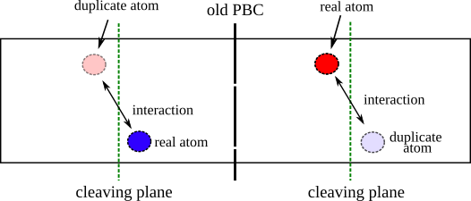

# Fix move duplicate


## Syntax 

```
fix_style ID group-ID move/dupl args
```

- args=list of the possible arguments

```
   C_ID = ID of the compute displace/atom
```

This fix allows to translate the duplicate atoms of the same distance crossed by the corresponding real atoms. In step3 of the cleaving methodology the duplicate atoms allow to calculate the cross-cleaving plane interactions but they need to "follow" the real atoms when they move in a new position each time step. 


In the step3 the system (solid+liquid) is duplicated and `real` and `duplicate` atom types are defined (see [example LJ-SL](example_SL.md) for more details).



The atoms interacts with one another. The duplicate atoms are used to keep track of the interactions crossing the cleaving planes, which are the ones to be calculated in order to find the total work in step3. 

The equation of motion must be integrated _only_ for the real atoms. The atoms then move by a distance $\Delta \mathbf{x}$.


This fix allows the duplicated atoms to follow the movement of the real atoms. By specifying this fix we are moving the atoms of the same quantity as the real atoms.


The equation of motion must be integrated _only_ for the real atoms. The atoms then move by a distance $\Delta \mathbf{x}$.


```{footbibliography}

```
