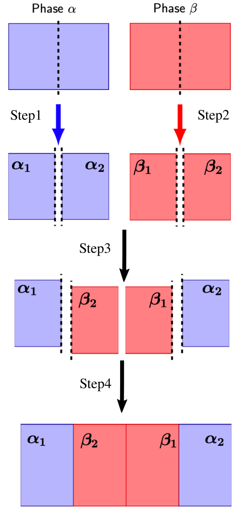

# Summary

The numerical calculation of the properties of the interface between different materials or different phases of the same material has always been an important problem due to the insight it can bring into understanding the mechanisms underlying various interfacial phenomena, but also because of the challenges of measuring such properties experimentally.

While the free energy of liquid-liquid and liquid-vapour interfaces is directly linked to the surface tension, which can be calculated from the anisotropy of the pressure tensor at the interface, the same approach cannot be used when a solid phase is present, since the interface introduces residual stresses in the nearby solid which, in turn, change the interfacial tension relative to the excess free energy [@DiPasquale2020shuttleworth]. As a result, a direct calculation of the free energy change during the formation of an interface from two separate bulk phases is required. While free energy calculation methods in general, and Thermodynamic Integration (TI) in particular, have been widely available in various molecular simulation packages, their use in conjunction with the complex geometry of an interfacial system is quite challenging and therefore much less common. Here we present a package for the calculation of the Interfacial Free Energy (IFE) of solid-vapour, solid-liquid and solid-solid interfaces for the widely used MD package LAMMPS (Large-Scale Atomic/Molecular Massively Parallel Simulator)[@Thompson2022].

# Statement of need

Interest in the study of the properties of interfaces with solid phases arises from the fact that many physical phenomena (*e.g.*, freezing, nucleation, confinement) and technological processes (*e.g.*, casting, welding, formulation) involving solid phases are governed by the structure and thermodynamics properties of the interface between solid and other phases.  Even though the definitions of various interfacial properties have been established a long time ago, starting with the works by Willard Gibbs [@GibbsCollectedWorks], their exact determination in experiments remains very difficult due to the fact that the interface is surrounded by dense bulk phases, as well as to the need for strict control of the experimental conditions required for precise measurements (*e.g.*, ensuring constant irregularity or porosity in all the samples on which the measurement is carried out). 

Given these difficulties, *in silico* experiments offer a viable way to obtain interfacial properties directly from their definitions in terms of intermolecular interactions, giving access to the complete structural and thermodynamic characterisation of the interface.  One of the fundamental thermodynamic properties of the interface is its excess free energy, which is defined as the amount of reversible work required to create a unit area of the interface between two bulk phases at coexistence conditions. Several indirect methods for the determination of this quantity exist, thanks to its link with the rate of nucleation (via, *e.g.*, classical nucleation theory), with contact angles between three or more phases (via, *e.g.*, the Young equation), or with capillary fluctuations of a diffuse interface. However, the accuracy of these methods is limited by the approximations inherent to the relevant theories.  

Direct determination of the IFE from the reversible work of creating an interface requires the careful design of a thermodynamic transformation path that starts from separate bulk phases equilibrated at coexistence conditions and ends with the same phases in contact across an interface. The cleaving method, originally proposed by Broughton and Gilmer [@Broughton1986Cleaving] for the calculation of the solid-liquid IFE in a Lennard-Jones system, constructs such a path from four basic steps: 

1. introduce an external 'cleaving potential' in a bulk solid system;
2. same as 1., but for the liquid system;
3. rearrange the boundary conditions to merge the systems while maintaining the cleaving potentials;
4. remove the cleaving potentials. 

{ width=30% }

A sketch of the cleaving path to obtain the IFE between two generic phases $\alpha$ and $\beta$ is shown in \autoref{fig:cleaving}. The reversible work in each step can be determined by different free energy computation methods, but those based on thermodynamic integration are the most straightforward and provide accurate and direct results. With TI methods the free energy difference between two thermodynamic states connected by a transformation path is calculated by integrating the ensemble average of some configuration-dependent function (*e.g.*, the potential energy) with respect to a parameter defining the path from the initial to the final thermodynamic state.

To date, the cleaving model, which owes its name to the fact that each bulk phase is "cleaved", *i.e.*, cut at a certain position to create the new interface, has been used to calculate the solid-liquid IFE in hard and soft spheres [@Davidchack00prl;@Davidchack05prl], Lennard-Jones
[@Davidchack03direct;@DiPasquale2020shuttleworth], TIP4P model water [@Handel08prl;@Davidchack12ice], Embedded-Atom Model (EAM) iron [@Liu2013csm], silver-ethylene glycol [@Qi2016jcp], orcinol-chloroform and orcinol-nitromethane [@addula2020computation], as well as for the calculation of the surface free energy of molecular crystals, such as mannitol [@DiPasquale2022cleaving].  However, due to the rather involved multi-step calculations required by the cleaving method, its use so far has been limited to a few research groups.  Wider adoption of the cleaving approach for the calculation of solid-liquid and solid-solid IFE for different forcefields requires a more convenient simulation interface for the construction of the thermodynamic transformation path and calculation of the reversible work along this path. Within this work, we attempt to fill this need with the CLEAVING package, which is designed to make it more straightforward for LAMMPS users to access the calculation of solid-liquid and solid-solid IFE in a wide variety of systems. Although the package in its current form does not include yet all the different interactions explored in the literature, it allows to reproduce the results in [@Davidchack03direct;@DiPasquale2022cleaving;@DiPasquale2020shuttleworth] and gives all the machinery needed to extend the calculations to more complex interaction models. The package we are presenting makes the addition of a new interaction type a straightforward extension of the code already given here.

# Functionality

CLEAVING is a LAMMPS package for the calculation of IFE using thermodynamic integration. The package includes several new additional functions written in the style suited to be directly patched into LAMMPS, comprising interactions between atoms needed to run the MD simulation with the cleaving model and some auxiliary functionalities (in LAMMPS terms, new "fix" and "compute") needed to perform the operations required to carry out the different steps of the calculation. 

The version of the code we present here is hosted on GitHub, where a detailed instruction manual is complemented by some step-by-step examples reproducing some of the published results on the topic. 
The package includes new definitions of pair potentials not included in LAMMPS, as the Broughton-Gilmer modified Lennard-Jones potential [@Broughton1983] and modifications of some of the already existing `pair_style`s in LAMMPS. In particular, we included a modified version of the `lj/cut` and `coul/dsf` potentials. These modifications allow to execute the third step of the cleaving method, where the interactions between the phases are switched on and off. The difficulty in this case is to keep track of the interactions between atoms involved in the switching since the work performed during this particular step depends on them. Moreover, these new `pair_style`s support different scaling (*i.e.*, different powers of the coupling parameter $\lambda$, see *e.g.*, [@DiPasquale2022cleaving]).

The processing of the interactions to generate the work in step 3 is carried out by the new compute `cleavpairs`, which generates the output file needed for the calculation of the IFE. The cleaving operation is carried out through an external potential, that is, a potential depending on the absolute position of atoms within the simulation box. In the CLEAVING package, there are two external potentials available: the "walls" and the "wells". These two external potentials are two additional fix styles, namely `wallforce` and `wellPforce`. We refer to the documentation for a detailed explanation of their use.
A new fix style `move/dupl` used in step 3 to switch the interactions between phases in contact is also included.

The new functionalities presented here are extremely general and can be applied to a variety of problems, making this package flexible and generalisable to different systems, thus answering one of the problems in the community, which is the lack of well-maintained codes to carry out interfacial calculations to avoid relying on in-house codes and custom extensions.  

# Acknowledgements

We acknowledge support from the CECAM and CCP5 through the CECAM/CCP5 sandpit grant ((EP/V028537/1)) awarded to Nicodemo Di Pasquale and Lorenzo Rovigatti.

# References

